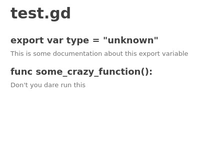

# gd_docs
A super-simple documentation generator for gd-script

This is a duper-simple super-dump system that I hope can be replaced at some later 
date. It looks through .gd files for the keyword `# PUBLIC`. Any folloging comment
blocks or docstrings are put into a markdown file. 

Invoke with:
```
python3 gdscript_docs.py --projectfile ./path/to/project.godot --outfolder ./documentation
```

Caution: this script is super-dumb and uses some terrible parsing methods. It'll
probably fail miserably on everyone elses `*.gd` files. Feel free to submit PR's
that make it better.


## Example:
```
# PUBLIC
# This is some documentation about this export variable
export var type = "unknown"


# PUBLIC
func some_crazy_function():
	"""Don't you dare run this"""
```

Gets turned into:  



It also inspects the project.godot file to build a list of autoloads, so it can generate an index page.
